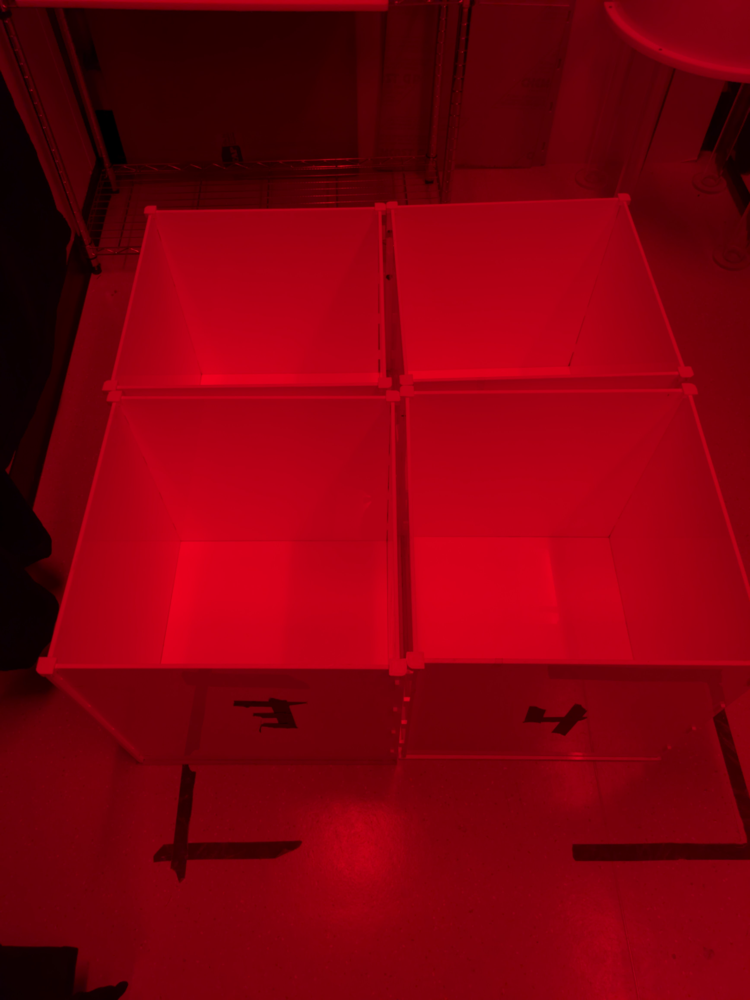

# FeederZoo_3D-models
Repository containing most of my 3d-printed models classified by their function
Contains my OpenSourceOpenField and a bunch of other stuff including the whole FeederZoo (multiple rodent feeders over the years)

Contents:
- BrainSurgery models
- FeederZoo models (lots of stuff here)
- OpenSourceLabEquipment (various models from various places)
- OpenSourceOpenField

